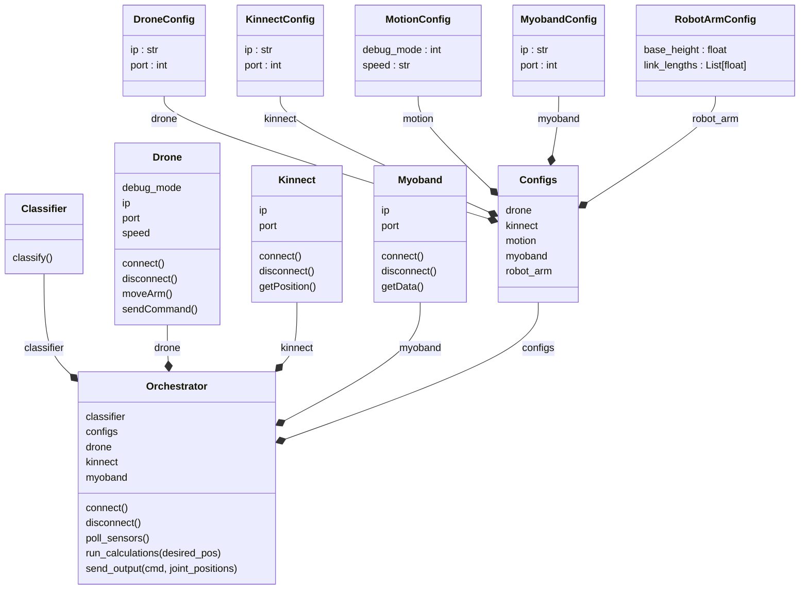
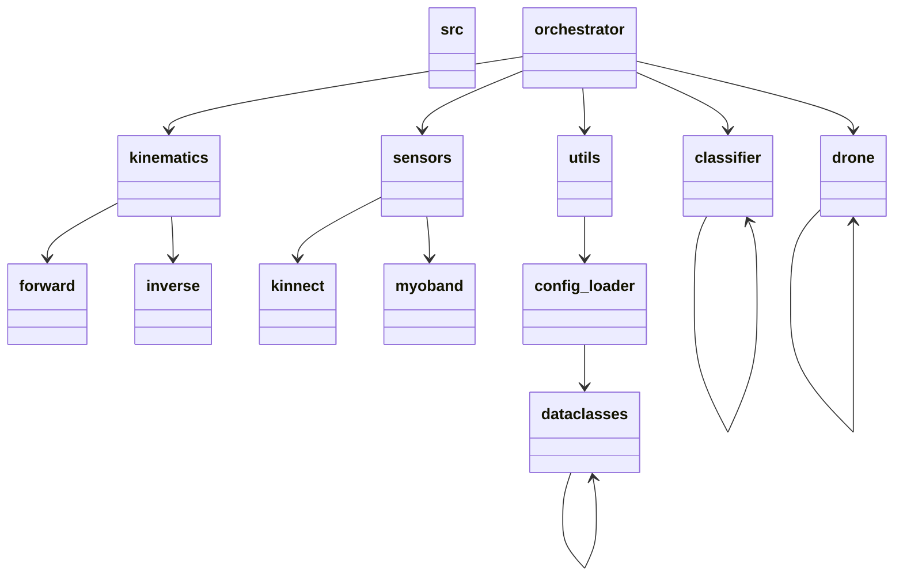

# myobotanica

To create the venv, run: `python -m venv venv`

To activate the venv run: `source venv/bin/activate` (or `venv\Scripts\activate` on Windows)

To install the requirements in the venv run: `pip install -r requirements.txt`

To remake the diagram run `pyreverse src/ --output mmd` (Available formats are: .dot, .puml, .plantuml, .mmd, .html)

